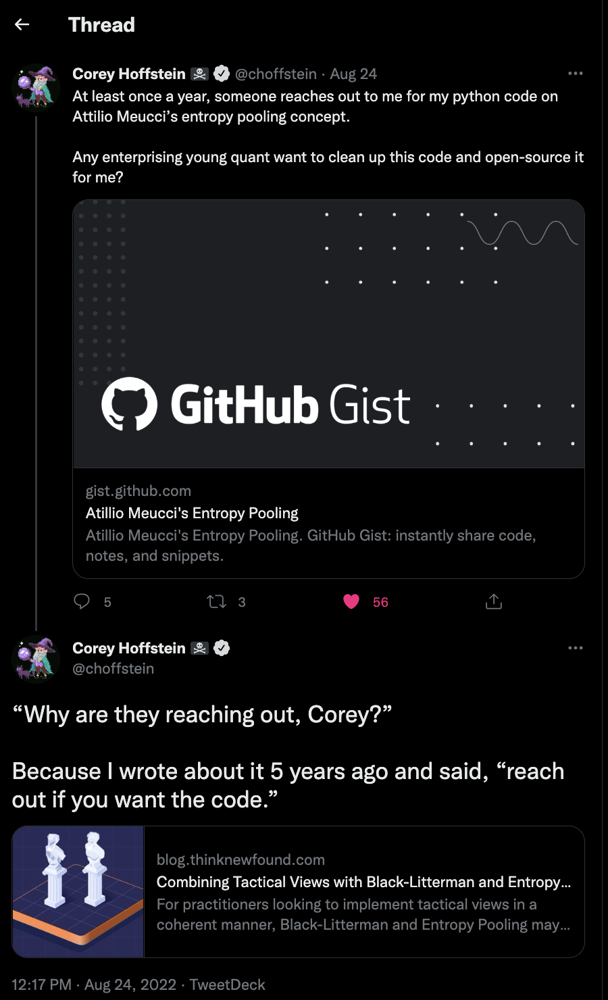

# Black-Litterman Entropy Pooling
Python package implementing Attilio Meucci's [Black-Litterman Entropy Pooling Adaptation](https://ssrn.com/abstract=1213325).

## Genesis
Corey Hoffstein wrote a blog post, [Combining Tactical Views with Black-Litterman and Entropy Pooling](https://blog.thinknewfound.com/2017/07/combining-tactical-views-black-litterman-entropy-pooling/), describing an adaptation to Black-Litterman published by Attilio Meucci. The adaptation simplifies Black-Litterman by using rank ordering of expected relative instrument returns to generate asset weights.

## Quick Start
The easiest way to get started is download the code and run the example.

```
git clone git@github.com:westonplatter/Black-Litterman-Entropy-Pooling.git
cd Black-Litterman-Entropy-Pooling
pip install -r requirements.txt
python example.py

                       Prior  Posterior
asset_class                            
Credit - High Yield     0.08   0.079390
Equity - US Small       0.06   0.060178
Bond - INT Treasuries   0.04   0.040517
Credit - REITs          0.02   0.019859
Alternative - Gold      0.00  -0.002101
```

## Credit
Research: Attilio Meucci, https://papers.ssrn.com/sol3/papers.cfm?abstract_id=1213325.  
Initial code implementation: Corey Hoffstein, https://gist.github.com/choffstein/90a1be0da8800114d00abdd9c395ff2b.  
Code refinement and packaging: Weston Platter, https://github.com/westonplatter/Black-Litterman-Entropy-Pooling/.  

Here's [the tweet](https://twitter.com/choffstein/status/1562504266878558212) that started the codebase.

[](tweet.png)

## License
Copyright (c) 2017 Corey Hoffstein, MIT License.